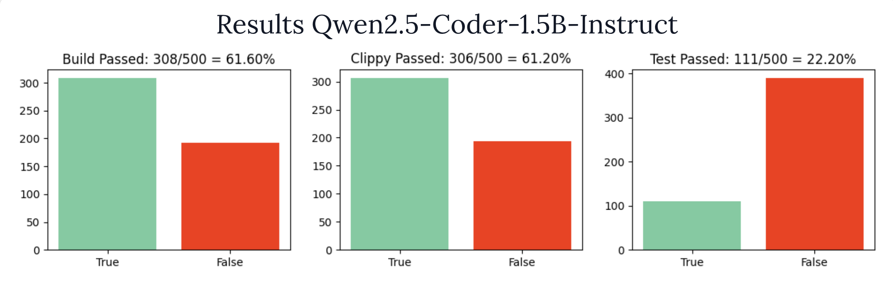
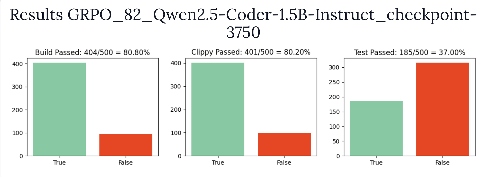
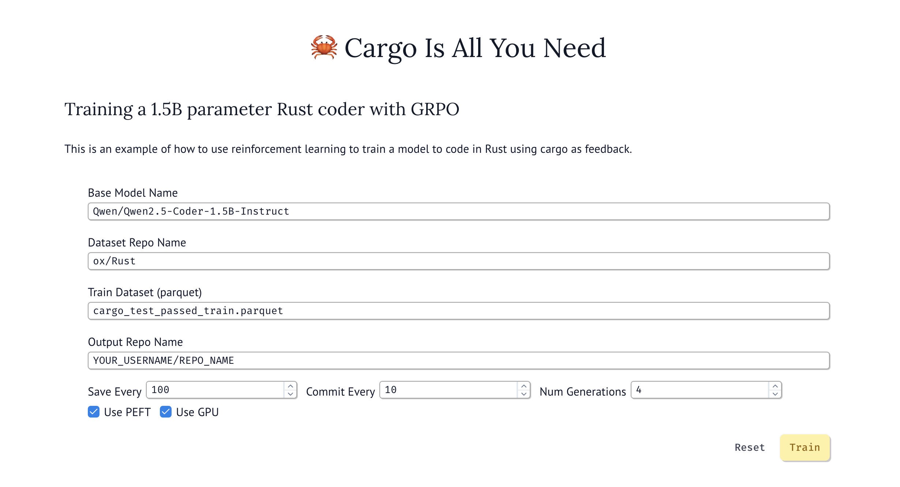
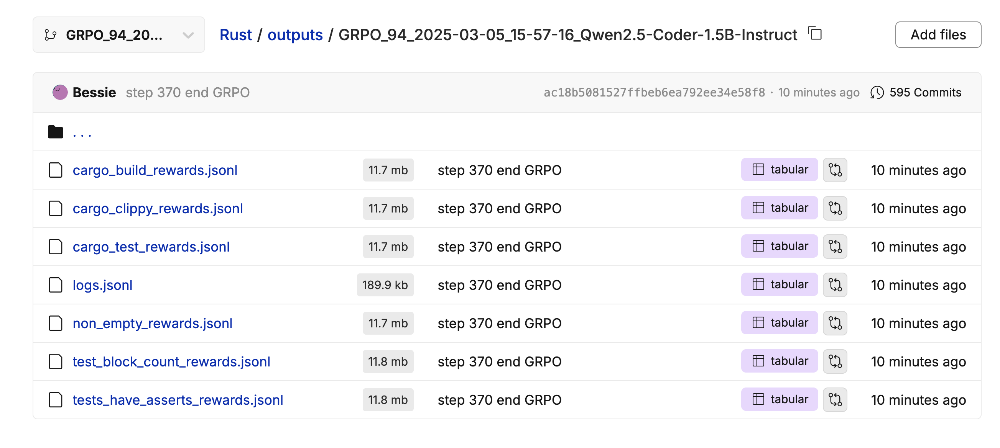
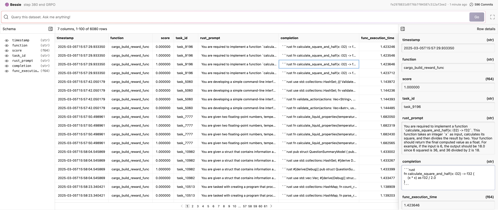
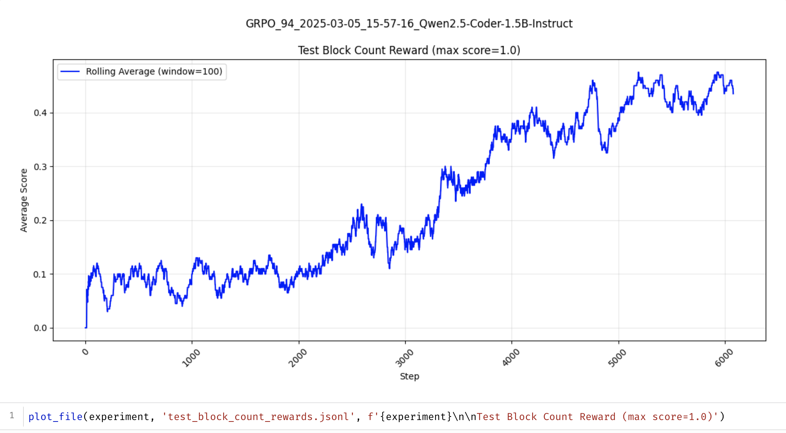
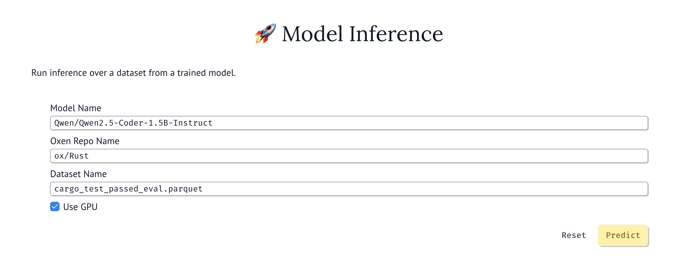
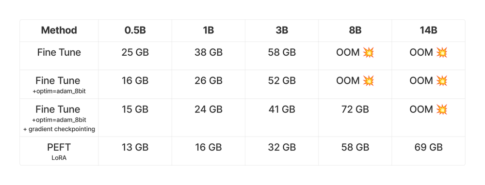

# 🦀 GRPO-With-Cargo-Feedback

This repository goes along with the blog post [Train a Rust 1.5B Coder LLM with Reinforcement Learning (GRPO)](https://www.oxen.ai/blog/training-a-rust-1-5b-coder-lm-with-reinforcement-learning-grpo). It is composed into a set of [Marimo Notebooks](https://marimo.io/) to make the experiments reproducible and easy to run.

# 🥅 Goal

The goal of this repository is to fine-tune a small language model (1.5B) with reinforcement learning to become better at Rust programming. The idea is to use the `cargo` build tool as feedback for the model. It runs `cargo build`, `cargo clippy`, and `cargo test` on LLM generated Rust programs to improve the model over time. The first experiment we ran was taking `Qwen2.5-Coder-1.5B-Instruct` as a starting point and fine tuning it with GRPO.

# 📈 Results

All of the data and results were saved to the [ox/Rust](https://www.oxen.ai/ox/Rust) repository in Oxen.ai. After a single epoch it improved the model's ability to write code that compiles by 20% and ability to write code that pass unit tests by 15%.

### Starting Instruct Model

[View Raw Results](https://www.oxen.ai/ox/Rust/file/main/results/Qwen2.5-Coder-1.5B-Instruct/results_code_and_tests.parquet)

### After 1 Epoch of Fine-Tuning with GRPO

[View Raw Results](https://www.oxen.ai/ox/Rust/file/main/results/GRPO_82_2025-03-02_22-49-17_Qwen2.5-Coder-1.5B-Instruct/results_code_and_tests.parquet)

# 📒 Running the Notebooks

There are 4 main notebooks used to train, evaluate, and monitor the results.

1) [train.py](train.py) - Train the model using GRPO
2) [viz.py](viz.py) - Visualize the reward functions
3) [inference.py](inference.py) - Run inference on a model checkpoint
4) [eval.py](eval.py) - Run the results of inference through the Rust toolchain to compute accuracy.

## 🏋️ Training

The [train.py](train.py) notebook allows you to put in a base model, Oxen.ai repository to pull data from, and an [Oxen.ai](https://oxen.ai) repository to write data back to. If you want to run it, simply create an account [here](https://oxen.ai), create a repo, and [setup your api key](https://docs.oxen.ai/getting-started/cli) locally.

This will write the logs to a branch within Oxen.ai as jsonl files so that we can look at the data that is generated and plot the rewards later.

For example, here is the cargo build rewards logs.

## 📊 Visualization

The logs from the training run then can easily be visualized with the [viz.py](viz.py) notebook. This pulls the results from the output repository from the training script given a branch name.

## 🚀 Inference

Once you have a trained model, you can run inference on it with the [inference.py](inference.py) notebook.

## 🧐 Evaluation

Finally once you have an output file from the Inference script, you can evaluate the output with the [eval.py](eval.py) notebook. This will result in a graph similar to the ones at the top with the % passed for each cargo tool.

# 🖥️ GPU Requirements

If you are curious about the GPU requirements, feel free to the following blog post where we run different experiments. There are also libraries such as unsloth that reduce the VRAM requirements, but we have not tried them yet.

Blog: [GRPO VRAM Requirements For the GPU Poor](https://www.oxen.ai/blog/grpo-vram-requirements-for-the-gpu-poor)

# 🐂 What is Oxen.ai?

This project is powered by [Oxen.ai](https://oxen.ai) 🐂 🌾

Oxen.ai provides open-source tools to track, iterate, collaborate on, and discover large datasets in any format. Within the Oxen.ai toolchain a lightning fast data version control tool, data vizualization, notebooks, and ability to run models on your data. You can learn more at https://oxen.ai.
